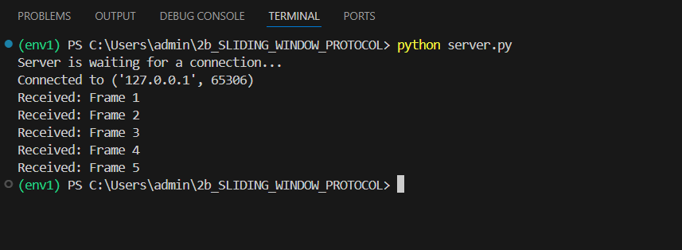
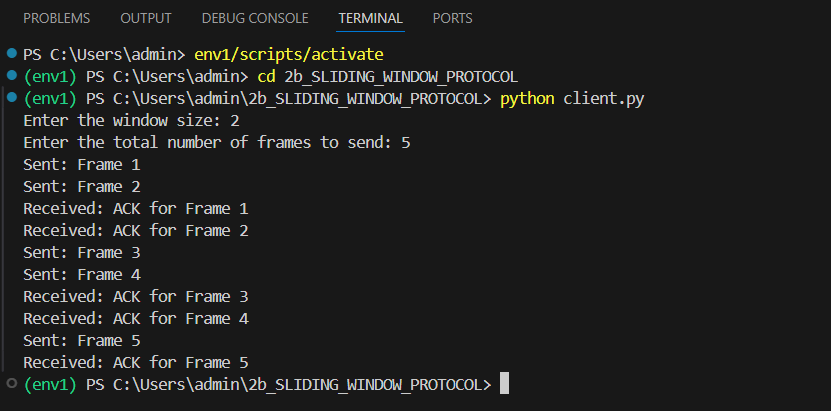

# 2b IMPLEMENTATION OF SLIDING WINDOW PROTOCOL
## AIM
## ALGORITHM:
1. Start the program.
2. Get the frame size from the user
3. To create the frame based on the user request.
4. To send frames to server from the client side.
5. If your frames reach the server it will send ACK signal to client
6. Stop the Program
## PROGRAM
server.py
```
import socket


server_socket = socket.socket()
server_socket.bind(('localhost', 8000))
server_socket.listen(1)
print("Server is waiting for a connection...")


conn, addr = server_socket.accept()
print(f"Connected to {addr}")

while True:
    frame = conn.recv(1024).decode()
    if frame == "END":
        break
    print(f"Received: {frame}")
    conn.send(f"ACK for {frame}".encode())


conn.close()
server_socket.close()
```

client.py
```

```
## OUPUT

Server : 



Client :



## RESULT
Thus, python program to perform stop and wait protocol was successfully executed
